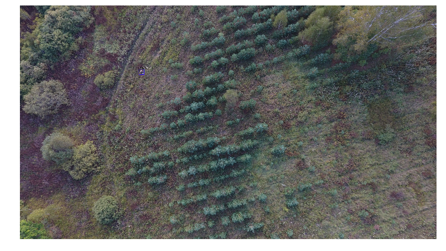
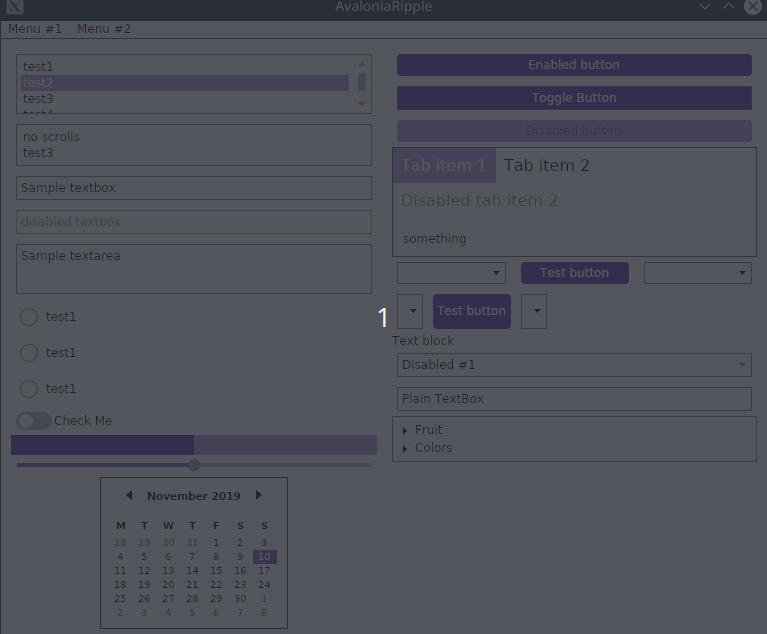
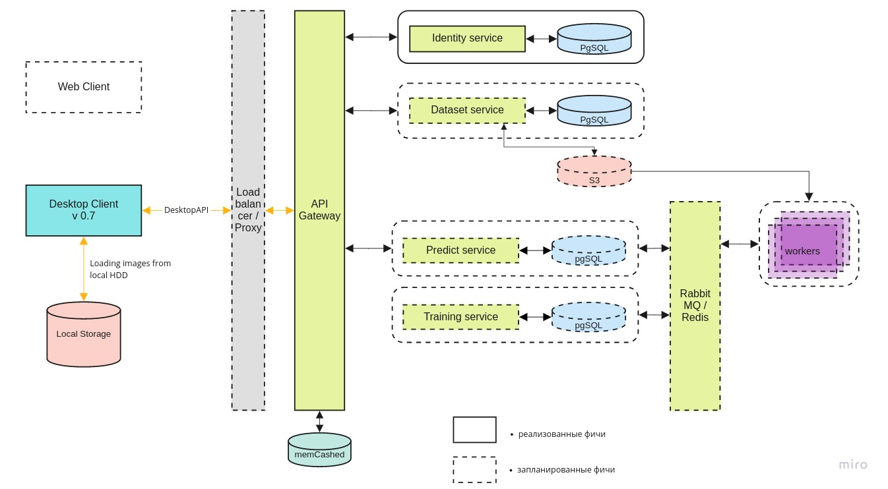

# Проект Lacmus: как компьютерное зрение помогает спасать заблудившихся людей  
  

### Введение  

Всем привет!  

Возможно, вы уже слышали про инициативу Machine Learning for Social Good (**#ml4sg**) сообщества [Open Data Science](https://ods.ai/). В рамках неё энтузиасты на бесплатной основе применяют методы машинного обучения для решения социально-значимых проблем. Мы, команда проекта Lacmus, занимаемся внедрением современных Deep Learning-решений для поиска людей, потерявшихся вне населённой местности: в лесу, в поле.

По приблизительным оценкам, в России каждый год пропадает более ста тысяч человек. Ощутимую часть из них составляют люди, заблудившиеся вдали от человеческого жилья. Некоторые из потерявшихся, к счастью, выбираются сами, для помощи другим мобилизуются добровольческие поисково-спасательные отряды (ПСО). Наиболее известным ПСО является, пожалуй, Liza Alert, но хочется отметить, что он отнюдь не единственный.

Основными способами поиска на данный момент, в XXI-ом веке, является пешее прочёсывание окрестностей с применением технических средств, которые зачастую не сложнее сирены или гудящего маяка. Тема, конечно, актуальная и горячая, порождает много идей по использованию в поисках достижений научно-технического прогресса; некоторые из них даже воплощаются в виде прототипов и тестируются в специально организованных конкурсах. Но лес - это лес, и реальные условия поисков вкупе с ограниченностью материальных ресурсов делают эту проблему сложной и ещё очень далёкой от полного решения.  
Для осмотра больших участков территории в последнее время спасатели все чаще применяют беспилотные летательные аппараты (БПЛА), фотографирующие местность с высоты 40-50м. С одной поисково-спасательной операции (ПСО) получается несколько тысяч фотографий, которые на сегодняшний день добровольцы отсматривают вручную. Понятно, что такая обработка это долго и неэффективно, через два часа такой работы люди устают и не могут продолжать поиск - а ведь от его скорости зависит здоровье и жизнь людей.  

Совместно с поисково-спасательными отрядами мы занимаемся разработкой программы для поиска пропавших людей на снимках, сделанных с БПЛА. Как специалисты по машинному обучению, мы стараемся сделать поиск автоматическим и быстрым.

### Технические трудности    

Недавно был проведен конкурс "Одиссея", в котором разные команды соревновались в поиске лучшего решения для поиска и спасения людей, в том числе с помощью БПЛА.  
Мы обобщили результаты этого конкурса, а также опыт работы разных спасательных отрядов, и пришли к выводу, что имеется ряд нерешенных вопросов:  

- Снимки, полученные в ходе поисковых операций, в дальнейшем никак не используются.
Все полученные фотографии просто складываются в одну папку, никто их не размечает.
При таком подходе очень тяжело использовать полученный опыт, потому что данные сами по себе очень несбалансированные.
На один снимок с найденным человеком приходится несколько тысяч "пустых" фотографий.

- Не учитывается статистика по позам, в которых находились найденные люди, время года, тип местности и другие особенности снимков.
Вообще, на сегодняшний день очень мало хороших датасетов со снимками с БПЛА.
Самый известный - это Stanford Drone Dataset, имеет подходящий класс изображений "Pedestrian", но эти пешеходы имеют мало общего с людьми на наших снимках.
Проведенные эксперименты подтвердили: метрики качества нейросетевых детекторов, обученных на стэнфордском датасете, на наших данных оставляют желать лучшего.

- Нет централизованного хранилища для размеченных данных.
Ценная информация никак не используется для обучения нейросетей, качество которых напрямую зависит от объема обучающей выборки.  
Помимо технических сложностей, мы столкнулись с юридическими препятствиями, накладывающими ограничения на право собственности полученных снимков.

- Мы не первые, кто пытается решить задачу поиска людей с помощью DL подходов.
Однако во всех известных нам решениях использованы популярные архитектуры нейросетей (YOLO, SSD), которые имеют хорошие метрики качества на публичных датасетах (ImageNet и др.), но плохо работают на наших снимках.
Для того, чтобы попробовать разные архитектуры и найти лучшее решение, требуется очень много времени и вычислительных мощностей.

- Практически никто не использует возможности по оптимизации моделей для инференса.
В районах поиска часто нет выхода в интернет, поэтому нужно обрабатывать полученные снимки локально.
Большинство спасателей пользуются ноутбуками с маломощными GPU, или вовсе без них, запуская нейросети на обычных CPU.
Легко посчитать, что если на обработку одного снимка тратится в среднем 10 секунд, 1000 снимков будут обрабатываться около 3 часов.
Тут, как говорится, каждая секунда на счету.  

### Подготовка данных   

В первую очередь, мы собрали уникальную статистику по позам, в которых чаще всего находят без вести пропавших людей.
Отсняли и разметили уникальный [Lacmus Dataset](https://yadi.sk/d/4Hz_1qpiNbHhpQ), первая версия которого включает в себя более 400 снимков.
Съемка велась преимущественно с помощью DJI Mavic Pro и Phantom с высоты 50 - 100 метров, разрешение снимков 3000х4000, размер человека в среднем 50х100 px.
Использованы как реальные снимки, так и "смоделированные", в которых несколько человек в разных позах и одежде имитировали потерявшихся.  

  

По мере пополнения нашего датасета, мы пришли к необходимости разделять снимки по временам года.
Дело в том, что если тренировать нейросеть на зимних фото, то mAP на всех остальных временах года получается на уровне 0.8 - 0.9.
Если же для тренировки использовать летние или весенние снимки, то получается на лете до 0.9, но на зиме менее 0.6.
Видимо, признаки на снежном фоне извлекаются лучше, чем на зашумленной траве.

Лучшие метрики, полученные на зимних фото, представлены в таблице.  

Тип | mAP | FPS (GPU / CPU)
--- | --- | :---:
SSD | 0.56 |  15 / 150
YOLOv3 | 0.72 |  20 / 194
RetinaNet/mobileNetv2 | 0.67 |  32 / 300+
RetinaNet/ResNet50 | 0.91 |  1 / 45
DarkNet |   0.89 | 10 / 80
Unet | 0.96 | 0.5 / 20+

### Процесс обучения  

Для бэкбоунов мы брали модели, предобученные на ImageNet, отрывали последний слой и дообучали на Stanford Drone Dataset.
Детекторы обучались непосредственно на наших снимках.
Все наши снимки имеют такую важную особенность как большой дисбаланс классов: отношение площади фона к площади искомого объекта (его прямоугольного анкора) составляет несколько тысяч.

Дисбаланс классов при обучении детектора влечет за собой две проблемы:  
1) Большинство регионов, содержащих фон, не несут никакой полезной информации.  
2) Регионы с объектами ввиду их малой численности не вносят существенного вклада в обучение весов сети в процессе обучения.  

Чтобы как-то обойти этих проблемы, использовались различные схемы обучения и составления обучающих выборок.
В итоге по соотношению точность / производительность на наших снимках лучше всех показала себя RetinaNet с бэкбоуном ResNet50.
Оригинальная архитектура RetinaNet [была представлена](https://arxiv.org/abs/1708.02002) в 2017 году.

Структурно RetinaNet состоит из бэкбоуна и двух дополнительных сетей классификации (Classification Subnet) и определения границ объекта (Box Regression Subnet).

В качестве бэкбоуна используется сверточная нейросеть, имеющая дополнительные выходы со скрытых слоев (**Feature Pyramid Network, FPN**).
Она позволяет выделить из исходного изображения пиримиду признаков в разных масштабах, на которых могут быть обнаружены как большие, так и мелкие объекты.
FPN используется во многих архитектурах, улучшая детекцию объектов разного масштаба: RPN, DeepMask, Fast R-CNN, Mask R-CNN и т.д.  
Более подробно про FPN можно почитать в [оригинальной статье](FPN).

В нашей сети, как и в оригинальной, использована FPN из ResNet50, с дополнительными выходами со слоев с 3 по 7,
Все уровни пирамиды имеют одинаковое количество каналов С = 256 и количество анкоров А около 1000 (зависит от размера изображений).  

Анкоры (границы объектов) имеют площади от [32 х 32] до [512 x 512] с шагом смещения (strides) [16 - 256] px на каждом уровне пирамиды признаков.
В оригинальной [FPN](https://arxiv.org/pdf/1612.03144.pdf) используются три значения ориентации анкоров (1:2, 1:1, 2:1).
В RetinaNet для более плотного покрытия добавлено масштабирование анкоров [2^0, 2^1/3, 2^2/3].
Применение 9 анкоров на каждом уровне позволяет находить объекты c длиной / шириной от 32 до 813 px.

**Classification Subnet** предсказывает вероятность присутствия для каждого из К классов в заданном анкоре.
По сути это простая полносвязная сеть (Fully ConvNet, FCN), присоединенная к каждому из уровней FPN.
Ее параметры на различных уровнях пирамиды одинаковы, и архитектура ее довольно простая:  
- на вход подается карта признаков (W x H x C),
- 3х3 свертка с С фильтрами,
- ReLU активация,
- 3х3 свертка с (К х А) фильтрами,
- сигмоид активация последнего слоя.  

Итого на выходе этой сети формируется вектор длиной К, по количеству классов для разных объектов.
В нашем случае используется только один класс - это Pedestrian.

**Box Regression Subnet** позволяет более точно подогнать 4-вектор координат анкора под размер объекта.
Это небольшая полносвязная сеть, прикрепленная к каждому из уровней FPN, которая работает независимо от Classification Subnet.
Их архитектуры почти одинаковы, за исключением того, что при обучении минимизируется вектор размером (4 х А) - $ (\Delta x_min, \Delta y_min, \Delta x_max, \Delta y_max) $ для каждого анкора.  

Считается, что анкор содержит объект, если IoU (Intersection over Union) > 0.5.
В этом случае y_i назначается 1, иначе 0.
Такой подход позволяет сократить вычислительные затараты при обучении деетктора.

Главная особенность RetinaNet, позволяющая бороться с негативным влиянием дисбаланса классов при обучении Classification Subnet - это оригинальная функция потерь **Focal Loss**.

$$ FL(p_t) = − (1 − p_t)^γ log(p_t) $$    

$$
p_t =
\begin{cases}
  p, if y = 1,
  1 − p otherwise
\end{cases}
$$

Как правило, loss-функция должна быть робастной к выбросам (hard examples), сокращая их влияние на обучение весов.
В Focal Loss наоборот, снижается влияние наиболее часто встречающегося фона (inliers, easy examples), а наибольшее влияние при обучении весов RetinaNet оказывают выбросы - редко встречающиеся объекты.

В процессе обучения RetinaNet функция потерь вычисляется для всех ориентаций анкоров, на каждом слое FPN (всего около 10 000 областей для одного изображения).  
Это в корне отличается от известных подходов эвристической выборки (RPN) или поиска редких экземпляров (OHEM, SSD) с выбором небольшого количества областей (около 256) для каждого минибатча.  

Значение Focal loss вычисляется как сумма значений функции для всех областей, нормализованных по отношению к анкорам, классифицированных как "фон"".
Нормализация производится только по анкорам, содержащим объект, а не общему их числу.
Этот подход как раз и позволяет избежать нежелательного влияния большого числа отрицательных классов.

**Инференс** (детектирование объектов на изображении) заключается в вычислении forward функции бэкбоуна и двух подсетей.
Для повышения скорости классификация осуществляется только по тем областям,  у которых y > 0,05.
При этом в оригинальном детекторе дополнительно накладывается ограничение на максимальное количество областей на изображении – не более 1000.
На последней стадии детекции остаются только те области, вероятность классификации для которых превышает threshold = 0,5.

Более подробно про архитектуру RetinaNet можно еще почитать [здесь](https://towardsdatascience.com/review-retinanet-focal-loss-object-detection-38fba6afabe4).

Нами используется реализация на keras, оптимизированая для работы на GPU и CPU с поддержкой AVX.
Решение упаковано в docker контейнер, запускаемый на локальной машине, что позволяет избежать трудностей по настройке окружения.

### Production

С учетом пожеланий и запросов спасателей из Liza Alert, нами разработано desktop приложение под названием [Lacmus](https://github.com/lacmus-foundation/lacmus).
GUI написан на С# фреймворке AvaloniaUI, что позволяет запускать ее x64 OS win10, linux и mac.

По своей концепции он очень похож на WPF, что позволяет переносить на него  приложения не особо изменяя код.
Он быстр и эффективен, 2d графика в нем рисуется быстрее и потребляет меньше ресурсов, чем у WPF.
Также тут есть некоторые плюшки, улучшающие оригинальный WPF.
Помните эту войну со стилями и кастомными контролами?
Так вот тут можно сделать все немного иначе.
Стили могут работать схожим с css способом, что очень удобно.

Что касается внутреннего устройства то тут применяется библиотека SkeaSharp для отрисовки графики и GTK (для Unix систем).
Также ведётся разработка X11 рендера.
Всё это позволяет рисовать интерфейс везде где угодно, даже в буфере консоли.
Если бы dotnet core можно было бы запустить в Bios е то avalonia ui отрисовала бы там модный геймерский интерфейс, как на крутых материнских платах.

AvaloniaUI набирает популярность и является открытым фреймверком.
Также хочется сказать что у проекта довольно отзывчивая поддержка и разработчики быстро отвечают на issue.
Для полного понимания этой концепции стоит посмотреть [выступление](https://youtu.be/8qzqweimcFs) Никиты Цуканова [@kekekeks](https://github.com/kekekeks).
Он является разработчиком этого фреймверка, отлично в разбирается в нем и в dotnet в общем.

Еще помимо desktop приложения нами разработана mlOps инфраструктура для проведения экспериментов по поиску лучшей архитектуры нейросети в облаке.  

  

**Desktop-client** может работать как с локальной версией docker-контейнера, так и последней версией на центральном сервере, через REST API.  
**Identity** микросервис обеспечивает доступ к серверу только авторизованных пользователей.  
**Dataset** сервис служит для хранения как самих изображений, так и их разметки.  
**Predict** сервис позволяет осуществлять быструю обработку большого количества изображений при наличии широкого канала у пилотов.  
**Training** сервис нужен для тестирования новых моделей и дообучения существующих по мере поступления новых данных.  
Управление очередью задач осуществляется с помощью RabbitMQ / Redis.  

Сервера любезно предоставлены нам теплым ламповым ЦОД с масляным охлаждением (у них же есть название?) (Или не предоставлены?).

### Итого  

За прошедший 2019 год участники Lacmus Foundation:  

- отсняли и разметили уникальный [dataset](https://yadi.sk/d/4Hz_1qpiNbHhpQ), первая версия которого включает в себя более 400 снимков.

- попробовали ряд различных DL подходов и выбрали лучший,

- подобрали лучшие гиперпараметры нейронной сети и обучили ее на собственных уникальных данных для лучшего распознавания;

- разработали кросс-платформенное приложение для операторов БПЛА с возможностью использования нейронной сети на местах ПСР при работе оффлайн;

- оптимизировали работу нашей нейронной сети для работы на бюджетных и маломощных портативных компьютерах;

- создали средства защиты нашей программы от неправомерного использования.

Наша программа готова к использованию в условиях реальных ПСР и прошла тестирование на генеральных прогонах.
На открытых участках типа «поле» и «бурелом» обнаружены все тестовые «потерявшиеся».
На данный момент лучшие показатели метрики mAP нашей нейронной сети "Лакмус" – 94%.
Результаты по найденным объектам нейронной сетью "Лакмус" заинтересовали добровольческие поисково-спасательные отряды со всей России.
На счету нашей программы уже не одна спасенная жизнь.  

 В следующем году мы планируем:  

- найти партнера для надежного хостинга инфраструктуры,
- реализовать веб интерфейс и mlOps,
- сформировать большой синтетический датасет на движке Unity3D?
- запустить In Class соревнование на Kaggle для всех желающих прокачать свои DL/CV навыки и поиска наилучших SOTA решений.  

Нам очень не хватает рабочих рук для того чтобы реализовать эти планы, поэтому мы будем рады всем, независимо от уровня и направления подготовки.

Ведь если вместе мы сможем спасти хотя бы еще одного человека, то все приложенные усилия будут не зря.

### Благодарности

- Самым активным участникам ODS в канале #proj_rescuer_la : @Kseniia @balezz @ei-grad @dartov @sharov_am @Palladdiumm.
- Участникам проекта вне ODS: Мартынова Виктория Викторовна (организация проекта, сбор и разметка данных), Шуранков Денис Петрович (организация сбора данных), Перевозчикова Дарья Павловна (разместила около 30% всех фото).
- Операторам БПЛА из отряда Лиза Алерт, за снимку и набор данных: Партызан, Вантеич,  Севыч.
- Админам ODS за организацию самого крутого сообщества: @natekin, @Sasha, @mephistopheies.  

Руководитель проекта, Перевозчиков Георгий Павлович, @gosha20777.
